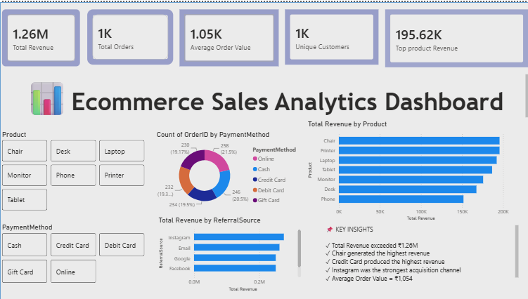

# Ecommerce Sales Analytics Dashboard

## Project Overview

This project was developed as part of the DecodeLabs Data Analytics Internship Program.

The objective of this project is to analyze ecommerce sales data and build an interactive Power BI dashboard that provides insights into business performance, customer behavior, product sales, payment preferences, and marketing effectiveness.

The dashboard enables stakeholders to monitor key business metrics and make data-driven decisions.

---

## Business Problem

Ecommerce businesses generate large volumes of transactional data daily. Without proper analysis, it becomes difficult to identify:

- Top-performing products
- Customer purchasing patterns
- Revenue drivers
- Effective marketing channels
- Payment preferences

This project transforms raw sales data into meaningful business insights through visualization and dashboard reporting.

---

## Dataset Information

The dataset contains ecommerce transaction records including:

- Order ID
- Customer ID
- Product
- Quantity
- Unit Price
- Total Price
- Payment Method
- Order Status
- Referral Source
- Transaction Date

### Dataset Size

- Total Records: 1200
- Total Features: 14

---

## Tools & Technologies Used

- Python
- Pandas
- SQL
- Power BI
- GitHub
- Microsoft PowerPoint

---

## Dashboard Features

### Executive Overview

The dashboard provides:

- Total Revenue
- Total Orders
- Average Order Value
- Unique Customers
- Top Product Revenue

### Interactive Filters

Users can filter data by:

- Product
- Payment Method

### Visualizations

- Revenue by Product
- Orders by Payment Method
- Revenue by Referral Source
- KPI Cards
- Business Insights Panel

---

## Key Insights

- Total Revenue exceeded ₹1.26 Million.
- Chair generated the highest revenue among all products.
- Credit Card transactions contributed the highest revenue.
- Instagram was the strongest customer acquisition channel.
- Average Order Value exceeded ₹1000.
- Product sales performance varied significantly across categories.

---

## Business Recommendations

### Product Strategy
Focus inventory planning and promotions on high-performing products.

### Customer Strategy
Implement customer retention programs targeting high-value customers.

### Marketing Strategy
Increase investment in successful acquisition channels such as Instagram and Email campaigns.

### Revenue Optimization
Monitor payment preferences and optimize checkout experiences to improve conversions.

---

## Project Structure

```text
ecommerce-sales-analytics-dashboard

├── dataset
│   └── cleaned_dataset.xlsx

├── dashboard
│   └── Ecommerce_Sales_Dashboard.pbix

├── screenshots
│   └── dashboard_overview.png

├── report
│   └── Ecommerce_Sales_Analytics_Dashboard.pdf

└── README.md
```

---

## Dashboard Preview

Insert dashboard screenshot below:



---

## Deliverables

- Power BI Dashboard (.pbix)
- Dashboard Report (PDF)
- Dashboard Screenshots
- GitHub Repository
- Business Recommendations

---

## Conclusion

This project demonstrates the complete analytics workflow from data preparation and analysis to business intelligence dashboard development.

The dashboard provides valuable insights into revenue performance, customer behavior, marketing effectiveness, and operational metrics, helping businesses make informed decisions and improve overall performance.

---

## Skills Demonstrated

- Data Cleaning
- Data Analysis
- SQL Querying
- Business Intelligence
- Dashboard Development
- Data Visualization
- KPI Reporting
- Business Communication
- Problem Solving

---

## Author

### Srinidhi Kukutam

Data Analytics Intern | DecodeLabs Internship Program

Aspiring Data Analyst | Power BI | SQL | Python | Data Visualization
